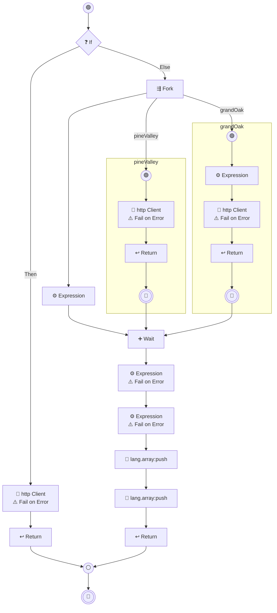

# get

## Diagram

```mermaid
flowchart TB
    START0(("🟢"))
    SWITCH1{"❓ If"}
    NETWORK_CALL3["📡 http Client<p>⚠️ Fail on Error</p>"]
    RETURN4["↩️ Return"]
    CLONE5["⇶ Fork"]
    subgraph pineValley  ["pineValley "]
        direction TB
        START6(("🟢"))
        NETWORK_CALL7["📡 http Client<p>⚠️ Fail on Error</p>"]
        RETURN8["↩️ Return"]
        END9((("🔴")))
    end
    subgraph grandOak  ["grandOak "]
        direction TB
        START10(("🟢"))
        EXPRESSION11["⚙️ Expression"]
        NETWORK_CALL12["📡 http Client<p>⚠️ Fail on Error</p>"]
        RETURN13["↩️ Return"]
        END14((("🔴")))
    end
    EXPRESSION15["⚙️ Expression"]
    AGGREGATE16["➕ Wait"]
    subgraph pineValley  ["pineValley "]
        direction TB
        START6(("🟢"))
        NETWORK_CALL7["📡 http Client<p>⚠️ Fail on Error</p>"]
        RETURN8["↩️ Return"]
        END9((("🔴")))
    end
    subgraph grandOak  ["grandOak "]
        direction TB
        START10(("🟢"))
        EXPRESSION11["⚙️ Expression"]
        NETWORK_CALL12["📡 http Client<p>⚠️ Fail on Error</p>"]
        RETURN13["↩️ Return"]
        END14((("🔴")))
    end
    EXPRESSION17["⚙️ Expression<p>⚠️ Fail on Error</p>"]
    EXPRESSION18["⚙️ Expression<p>⚠️ Fail on Error</p>"]
    LIBRARY_CALL19["🧩 lang.array:push"]
    LIBRARY_CALL20["🧩 lang.array:push"]
    RETURN21["↩️ Return"]
    SWITCH_MERGE2(("⚪"))
    NETWORK_CALL3["📡 http Client<p>⚠️ Fail on Error</p>"]
    RETURN4["↩️ Return"]
    CLONE5["⇶ Fork"]
    subgraph pineValley  ["pineValley "]
        direction TB
        START6(("🟢"))
        NETWORK_CALL7["📡 http Client<p>⚠️ Fail on Error</p>"]
        RETURN8["↩️ Return"]
        END9((("🔴")))
    end
    subgraph grandOak  ["grandOak "]
        direction TB
        START10(("🟢"))
        EXPRESSION11["⚙️ Expression"]
        NETWORK_CALL12["📡 http Client<p>⚠️ Fail on Error</p>"]
        RETURN13["↩️ Return"]
        END14((("🔴")))
    end
    EXPRESSION15["⚙️ Expression"]
    AGGREGATE16["➕ Wait"]
    subgraph pineValley  ["pineValley "]
        direction TB
        START6(("🟢"))
        NETWORK_CALL7["📡 http Client<p>⚠️ Fail on Error</p>"]
        RETURN8["↩️ Return"]
        END9((("🔴")))
    end
    subgraph grandOak  ["grandOak "]
        direction TB
        START10(("🟢"))
        EXPRESSION11["⚙️ Expression"]
        NETWORK_CALL12["📡 http Client<p>⚠️ Fail on Error</p>"]
        RETURN13["↩️ Return"]
        END14((("🔴")))
    end
    EXPRESSION17["⚙️ Expression<p>⚠️ Fail on Error</p>"]
    EXPRESSION18["⚙️ Expression<p>⚠️ Fail on Error</p>"]
    LIBRARY_CALL19["🧩 lang.array:push"]
    LIBRARY_CALL20["🧩 lang.array:push"]
    RETURN21["↩️ Return"]
    END22((("🔴")))
    START0 --> SWITCH1
    SWITCH1 -->|Then| NETWORK_CALL3
    NETWORK_CALL3 --> RETURN4
    SWITCH1 -->|Else| CLONE5
    CLONE5 -->|pineValley| START6
    START6 --> NETWORK_CALL7
    NETWORK_CALL7 --> RETURN8
    RETURN8 --> END9
    CLONE5 -->|grandOak| START10
    START10 --> EXPRESSION11
    EXPRESSION11 --> NETWORK_CALL12
    NETWORK_CALL12 --> RETURN13
    RETURN13 --> END14
    CLONE5 --> EXPRESSION15
    EXPRESSION15 --> AGGREGATE16
    END9 --> AGGREGATE16
    END14 --> AGGREGATE16
    AGGREGATE16 --> EXPRESSION17
    EXPRESSION17 --> EXPRESSION18
    EXPRESSION18 --> LIBRARY_CALL19
    LIBRARY_CALL19 --> LIBRARY_CALL20
    LIBRARY_CALL20 --> RETURN21
    RETURN4 --> SWITCH_MERGE2
    RETURN21 --> SWITCH_MERGE2
    SWITCH_MERGE2 --> END22
```
---

## Diagram

```mermaid
flowchart TB
    START0(("🟢"))
    SWITCH1["❓ If
<table><tr><td>Condition</td><td>doctorType == ...</td></tr></table>"]
NETWORK_CALL3["📡 http Client
<table><tr><td>Method</td><td>get</td></tr><tr><td>path(string)</td><td>/doctor/ + do...</td></tr><tr><td>Return</td><td>targetType|ball...</td></tr></table><strong>Variables:</strong><table><tr><td>hasitha/Hospita...</td><td>res</td><td>🆕</td></tr></table><p>⚠️ Fail on Error</p>"]
RETURN4["↩️ Return
<table><tr><td>Expression</td><td>res</td></tr><tr><td>Type</td><td>hasitha/Hospita...</td></tr></table>"]
CLONE5["⇶ Fork"]
subgraph pineValley  ["pineValley "]
direction TB
START6(("🟢"))
NETWORK_CALL7["📡 http Client
<table><tr><td>Method</td><td>get</td></tr><tr><td>path(string)</td><td>/doctor/ + do...</td></tr><tr><td>Return</td><td>targetType|ball...</td></tr></table><strong>Variables:</strong><table><tr><td>hasitha/Hospita...</td><td>res</td><td>🆕</td></tr></table><p>⚠️ Fail on Error</p>"]
RETURN8["↩️ Return
<table><tr><td>Expression</td><td>res</td></tr><tr><td>Type</td><td>hasitha/Hospita...</td></tr></table>"]
END9["🔴"]
end
subgraph grandOak  ["grandOak "]
direction TB
START10(("🟢"))
EXPRESSION11["⚙️ Expression
<table><tr><td>Expression</td><td>{doctorType: do...</td></tr></table><strong>Variables:</strong><table><tr><td>hasitha/Hospita...</td><td>req</td><td>🆕</td></tr></table>"]
NETWORK_CALL12["📡 http Client
<table><tr><td>Method</td><td>post</td></tr><tr><td>path(string)</td><td>/doctor/</td></tr><tr><td>path(string)</td><td>req</td></tr><tr><td>Return</td><td>targetType|ball...</td></tr></table><strong>Variables:</strong><table><tr><td>hasitha/Hospita...</td><td>res</td><td>🆕</td></tr></table><p>⚠️ Fail on Error</p>"]
RETURN13["↩️ Return
<table><tr><td>Expression</td><td>res</td></tr><tr><td>Type</td><td>hasitha/Hospita...</td></tr></table>"]
END14["🔴"]
end
EXPRESSION15["⚙️ Expression
<table><tr><td>Expression</td><td>[]</td></tr></table><strong>Variables:</strong><table><tr><td>hasitha/Hospita...</td><td>result</td><td>🆕</td></tr></table>"]
AGGREGATE16["➕ Wait
<table><tr><td>Wait</td><td>Wait for All</td></tr></table><strong>Variables:</strong><table><tr><td>record {|hasith...</td><td>aggregate</td><td>🆕</td></tr></table>"]
subgraph pineValley  ["pineValley "]
direction TB
START6(("🟢"))
NETWORK_CALL7["📡 http Client
<table><tr><td>Method</td><td>get</td></tr><tr><td>path(string)</td><td>/doctor/ + do...</td></tr><tr><td>Return</td><td>targetType|ball...</td></tr></table><strong>Variables:</strong><table><tr><td>hasitha/Hospita...</td><td>res</td><td>🆕</td></tr></table><p>⚠️ Fail on Error</p>"]
RETURN8["↩️ Return
<table><tr><td>Expression</td><td>res</td></tr><tr><td>Type</td><td>hasitha/Hospita...</td></tr></table>"]
END9["🔴"]
end
subgraph grandOak  ["grandOak "]
direction TB
START10(("🟢"))
EXPRESSION11["⚙️ Expression
<table><tr><td>Expression</td><td>{doctorType: do...</td></tr></table><strong>Variables:</strong><table><tr><td>hasitha/Hospita...</td><td>req</td><td>🆕</td></tr></table>"]
NETWORK_CALL12["📡 http Client
<table><tr><td>Method</td><td>post</td></tr><tr><td>path(string)</td><td>/doctor/</td></tr><tr><td>path(string)</td><td>req</td></tr><tr><td>Return</td><td>targetType|ball...</td></tr></table><strong>Variables:</strong><table><tr><td>hasitha/Hospita...</td><td>res</td><td>🆕</td></tr></table><p>⚠️ Fail on Error</p>"]
RETURN13["↩️ Return
<table><tr><td>Expression</td><td>res</td></tr><tr><td>Type</td><td>hasitha/Hospita...</td></tr></table>"]
END14["🔴"]
end
EXPRESSION17["⚙️ Expression
<table><tr><td>Expression</td><td>check aggregate...</td></tr></table><strong>Variables:</strong><table><tr><td>hasitha/Hospita...</td><td>pineValleyRes</td><td>🆕</td></tr></table><p>⚠️ Fail on Error</p>"]
EXPRESSION18["⚙️ Expression
<table><tr><td>Expression</td><td>check aggregate...</td></tr></table><strong>Variables:</strong><table><tr><td>hasitha/Hospita...</td><td>grandOakRes</td><td>🆕</td></tr></table><p>⚠️ Fail on Error</p>"]
LIBRARY_CALL19["🧩 lang.array:push
<table><tr><td>Return</td><td>()</td></tr></table>"]
LIBRARY_CALL20["🧩 lang.array:push
<table><tr><td>Return</td><td>()</td></tr></table>"]
RETURN21["↩️ Return
<table><tr><td>Expression</td><td>result</td></tr><tr><td>Type</td><td>hasitha/Hospita...</td></tr></table>"]
SWITCH_MERGE2(("⚪"))
NETWORK_CALL3["📡 http Client
<table><tr><td>Method</td><td>get</td></tr><tr><td>path(string)</td><td>/doctor/ + do...</td></tr><tr><td>Return</td><td>targetType|ball...</td></tr></table><strong>Variables:</strong><table><tr><td>hasitha/Hospita...</td><td>res</td><td>🆕</td></tr></table><p>⚠️ Fail on Error</p>"]
RETURN4["↩️ Return
<table><tr><td>Expression</td><td>res</td></tr><tr><td>Type</td><td>hasitha/Hospita...</td></tr></table>"]
CLONE5["⇶ Fork"]
subgraph pineValley  ["pineValley "]
direction TB
START6(("🟢"))
NETWORK_CALL7["📡 http Client
<table><tr><td>Method</td><td>get</td></tr><tr><td>path(string)</td><td>/doctor/ + do...</td></tr><tr><td>Return</td><td>targetType|ball...</td></tr></table><strong>Variables:</strong><table><tr><td>hasitha/Hospita...</td><td>res</td><td>🆕</td></tr></table><p>⚠️ Fail on Error</p>"]
RETURN8["↩️ Return
<table><tr><td>Expression</td><td>res</td></tr><tr><td>Type</td><td>hasitha/Hospita...</td></tr></table>"]
END9["🔴"]
end
subgraph grandOak  ["grandOak "]
direction TB
START10(("🟢"))
EXPRESSION11["⚙️ Expression
<table><tr><td>Expression</td><td>{doctorType: do...</td></tr></table><strong>Variables:</strong><table><tr><td>hasitha/Hospita...</td><td>req</td><td>🆕</td></tr></table>"]
NETWORK_CALL12["📡 http Client
<table><tr><td>Method</td><td>post</td></tr><tr><td>path(string)</td><td>/doctor/</td></tr><tr><td>path(string)</td><td>req</td></tr><tr><td>Return</td><td>targetType|ball...</td></tr></table><strong>Variables:</strong><table><tr><td>hasitha/Hospita...</td><td>res</td><td>🆕</td></tr></table><p>⚠️ Fail on Error</p>"]
RETURN13["↩️ Return
<table><tr><td>Expression</td><td>res</td></tr><tr><td>Type</td><td>hasitha/Hospita...</td></tr></table>"]
END14["🔴"]
end
EXPRESSION15["⚙️ Expression
<table><tr><td>Expression</td><td>[]</td></tr></table><strong>Variables:</strong><table><tr><td>hasitha/Hospita...</td><td>result</td><td>🆕</td></tr></table>"]
AGGREGATE16["➕ Wait
<table><tr><td>Wait</td><td>Wait for All</td></tr></table><strong>Variables:</strong><table><tr><td>record {|hasith...</td><td>aggregate</td><td>🆕</td></tr></table>"]
subgraph pineValley  ["pineValley "]
direction TB
START6(("🟢"))
NETWORK_CALL7["📡 http Client
<table><tr><td>Method</td><td>get</td></tr><tr><td>path(string)</td><td>/doctor/ + do...</td></tr><tr><td>Return</td><td>targetType|ball...</td></tr></table><strong>Variables:</strong><table><tr><td>hasitha/Hospita...</td><td>res</td><td>🆕</td></tr></table><p>⚠️ Fail on Error</p>"]
RETURN8["↩️ Return
<table><tr><td>Expression</td><td>res</td></tr><tr><td>Type</td><td>hasitha/Hospita...</td></tr></table>"]
END9["🔴"]
end
subgraph grandOak  ["grandOak "]
direction TB
START10(("🟢"))
EXPRESSION11["⚙️ Expression
<table><tr><td>Expression</td><td>{doctorType: do...</td></tr></table><strong>Variables:</strong><table><tr><td>hasitha/Hospita...</td><td>req</td><td>🆕</td></tr></table>"]
NETWORK_CALL12["📡 http Client
<table><tr><td>Method</td><td>post</td></tr><tr><td>path(string)</td><td>/doctor/</td></tr><tr><td>path(string)</td><td>req</td></tr><tr><td>Return</td><td>targetType|ball...</td></tr></table><strong>Variables:</strong><table><tr><td>hasitha/Hospita...</td><td>res</td><td>🆕</td></tr></table><p>⚠️ Fail on Error</p>"]
RETURN13["↩️ Return
<table><tr><td>Expression</td><td>res</td></tr><tr><td>Type</td><td>hasitha/Hospita...</td></tr></table>"]
END14["🔴"]
end
EXPRESSION17["⚙️ Expression
<table><tr><td>Expression</td><td>check aggregate...</td></tr></table><strong>Variables:</strong><table><tr><td>hasitha/Hospita...</td><td>pineValleyRes</td><td>🆕</td></tr></table><p>⚠️ Fail on Error</p>"]
EXPRESSION18["⚙️ Expression
<table><tr><td>Expression</td><td>check aggregate...</td></tr></table><strong>Variables:</strong><table><tr><td>hasitha/Hospita...</td><td>grandOakRes</td><td>🆕</td></tr></table><p>⚠️ Fail on Error</p>"]
LIBRARY_CALL19["🧩 lang.array:push
<table><tr><td>Return</td><td>()</td></tr></table>"]
LIBRARY_CALL20["🧩 lang.array:push
<table><tr><td>Return</td><td>()</td></tr></table>"]
RETURN21["↩️ Return
<table><tr><td>Expression</td><td>result</td></tr><tr><td>Type</td><td>hasitha/Hospita...</td></tr></table>"]
END22["🔴"]
subgraph Connector0 ["pineValleyEp"]
direction TB
EXTERNAL0["⚙️ http:Client
<table><tr><td>Name</td><td>pineValleyEp</td></tr></table>"]
end
subgraph Connector1 ["grandOakEp"]
direction TB
EXTERNAL1["⚙️ http:Client
<table><tr><td>Name</td><td>grandOakEp</td></tr></table>"]
end
subgraph Connector2 ["mapleRidgeEp"]
direction TB
EXTERNAL2["⚙️ http:Client
<table><tr><td>Name</td><td>mapleRidgeEp</td></tr></table>"]
end
subgraph Connector3 ["insurance"]
direction TB
EXTERNAL3["⚙️ http:Client
<table><tr><td>Name</td><td>insurance</td></tr></table>"]
end
NETWORK_CALL3 ==>|🔗|EXTERNAL2
EXTERNAL2 -.- NETWORK_CALL3
NETWORK_CALL7 ==>|🔗|EXTERNAL0
EXTERNAL0 -.- NETWORK_CALL7
NETWORK_CALL12 ==>|🔗|EXTERNAL1
EXTERNAL1 -.- NETWORK_CALL12
START0 --> SWITCH1
SWITCH1 -->|Then|NETWORK_CALL3
NETWORK_CALL3 --> RETURN4
SWITCH1 -->|Else|CLONE5
CLONE5 -->|pineValley|START6
START6 --> NETWORK_CALL7
NETWORK_CALL7 --> RETURN8
RETURN8 --> END9
CLONE5 -->|grandOak |START10
START10 --> EXPRESSION11
EXPRESSION11 --> NETWORK_CALL12
NETWORK_CALL12 --> RETURN13
RETURN13 --> END14
CLONE5 --> EXPRESSION15
EXPRESSION15 --> AGGREGATE16
END9 --> AGGREGATE16
END14 --> AGGREGATE16
AGGREGATE16 --> EXPRESSION17
EXPRESSION17 --> EXPRESSION18
EXPRESSION18 --> LIBRARY_CALL19
LIBRARY_CALL19 --> LIBRARY_CALL20
LIBRARY_CALL20 --> RETURN21
RETURN4 --> SWITCH_MERGE2
RETURN21 --> SWITCH_MERGE2
SWITCH_MERGE2 --> END22
```
---
