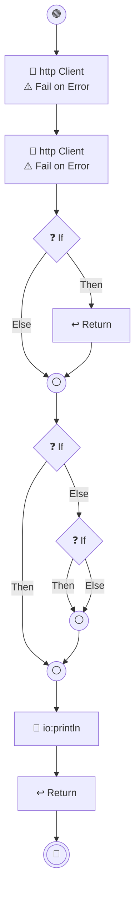
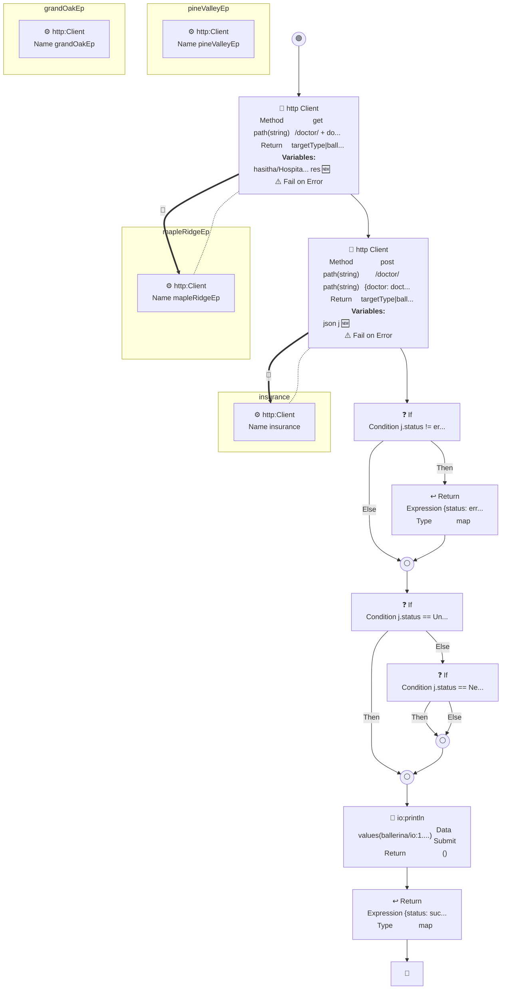

# post

## Diagram

```mermaid
flowchart TB
  START0(("🟢"))
  NETWORK_CALL1["📡 http Client<p>⚠️ Fail on Error</p>"]
  NETWORK_CALL2["📡 http Client<p>⚠️ Fail on Error</p>"]
  SWITCH3{"❓ If"}
  RETURN5["↩️ Return"]
  SWITCH_MERGE4(("⚪"))
  RETURN5["↩️ Return"]
  SWITCH6{"❓ If"}
  SWITCH8{"❓ If"}
  SWITCH_MERGE9(("⚪"))
  SWITCH_MERGE7(("⚪"))
  SWITCH8{"❓ If"}
  SWITCH_MERGE9(("⚪"))
  LIBRARY_CALL10["🧩 io:println"]
  RETURN11["↩️ Return"]
  END12((("🔴")))
  START0 --> NETWORK_CALL1
  NETWORK_CALL1 --> NETWORK_CALL2
  NETWORK_CALL2 --> SWITCH3
  SWITCH3 --> |Then| RETURN5
  SWITCH3 --> |Else| SWITCH_MERGE4
  RETURN5 --> SWITCH_MERGE4
  SWITCH_MERGE4 --> SWITCH6
  SWITCH6 --> |Then| SWITCH_MERGE7
  SWITCH6 --> |Else| SWITCH8
  SWITCH8 --> |Then| SWITCH_MERGE9
  SWITCH8 --> |Else| SWITCH_MERGE9
  SWITCH_MERGE9 --> SWITCH_MERGE7
  SWITCH_MERGE7 --> LIBRARY_CALL10
  LIBRARY_CALL10 --> RETURN11
  RETURN11 --> END12
```
---

## Diagram

```mermaid
flowchart TB
  START0(("🟢"))
  NETWORK_CALL1["📡 http Client
<table><tr><td>Method</td><td>get</td></tr><tr><td>path(string)</td><td>/doctor/ + do...</td></tr><tr><td>Return</td><td>targetType|ball...</td></tr></table><strong>Variables:</strong><table><tr><td>hasitha/Hospita...</td><td>res</td><td>🆕</td></tr></table><p>⚠️ Fail on Error</p>"]
  NETWORK_CALL2["📡 http Client
<table><tr><td>Method</td><td>post</td></tr><tr><td>path(string)</td><td>/doctor/</td></tr><tr><td>path(string)</td><td>{doctor: doct...</td></tr><tr><td>Return</td><td>targetType|ball...</td></tr></table><strong>Variables:</strong><table><tr><td>json</td><td>j</td><td>🆕</td></tr></table><p>⚠️ Fail on Error</p>"]
  SWITCH3["❓ If
<table><tr><td>Condition</td><td>j.status != er...</td></tr></table>"]
  RETURN5["↩️ Return
<table><tr><td>Expression</td><td>{status: err...</td></tr><tr><td>Type</td><td>map<json></td></tr></table>"]
  SWITCH_MERGE4(("⚪"))
  RETURN5["↩️ Return
<table><tr><td>Expression</td><td>{status: err...</td></tr><tr><td>Type</td><td>map<json></td></tr></table>"]
  SWITCH6["❓ If
<table><tr><td>Condition</td><td>j.status == Un...</td></tr></table>"]
  SWITCH8["❓ If
<table><tr><td>Condition</td><td>j.status == Ne...</td></tr></table>"]
  SWITCH_MERGE9(("⚪"))
  SWITCH_MERGE7(("⚪"))
  SWITCH8["❓ If
<table><tr><td>Condition</td><td>j.status == Ne...</td></tr></table>"]
  SWITCH_MERGE9(("⚪"))
  LIBRARY_CALL10["🧩 io:println
<table><tr><td>values(ballerina/io:1....)</td><td>Data Submit</td></tr><tr><td>Return</td><td>()</td></tr></table>"]
  RETURN11["↩️ Return
<table><tr><td>Expression</td><td>{status: suc...</td></tr><tr><td>Type</td><td>map<json></td></tr></table>"]
  END12["🔴"]
  subgraph Connector0 ["pineValleyEp"]
  direction TB
    EXTERNAL0["⚙️ http:Client
<table><tr><td>Name</td><td>pineValleyEp</td></tr></table>"]
  end
  subgraph Connector1 ["grandOakEp"]
  direction TB
    EXTERNAL1["⚙️ http:Client
<table><tr><td>Name</td><td>grandOakEp</td></tr></table>"]
  end
  subgraph Connector2 ["mapleRidgeEp"]
  direction TB
    EXTERNAL2["⚙️ http:Client
<table><tr><td>Name</td><td>mapleRidgeEp</td></tr></table>"]
  end
  subgraph Connector3 ["insurance"]
  direction TB
    EXTERNAL3["⚙️ http:Client
<table><tr><td>Name</td><td>insurance</td></tr></table>"]
  end
  NETWORK_CALL1 ==> |🔗| EXTERNAL2
  EXTERNAL2 -.- NETWORK_CALL1
  NETWORK_CALL2 ==> |🔗| EXTERNAL3
  EXTERNAL3 -.- NETWORK_CALL2
  START0 --> NETWORK_CALL1
  NETWORK_CALL1 --> NETWORK_CALL2
  NETWORK_CALL2 --> SWITCH3
  SWITCH3 --> |Then| RETURN5
  SWITCH3 --> |Else| SWITCH_MERGE4
  RETURN5 --> SWITCH_MERGE4
  SWITCH_MERGE4 --> SWITCH6
  SWITCH6 --> |Then| SWITCH_MERGE7
  SWITCH6 --> |Else| SWITCH8
  SWITCH8 --> |Then| SWITCH_MERGE9
  SWITCH8 --> |Else| SWITCH_MERGE9
  SWITCH_MERGE9 --> SWITCH_MERGE7
  SWITCH_MERGE7 --> LIBRARY_CALL10
  LIBRARY_CALL10 --> RETURN11
  RETURN11 --> END12
```
---
