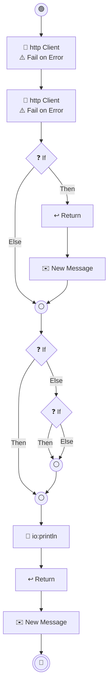
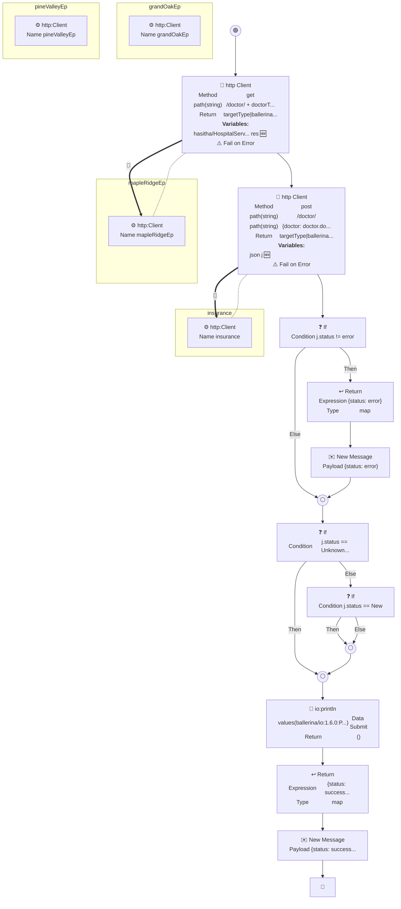

# post

## Diagram

```mermaid
flowchart TB
  START0(("🟢"))
  NETWORK_CALL1["📡 http Client<p>⚠️ Fail on Error</p>"]
  NETWORK_CALL2["📡 http Client<p>⚠️ Fail on Error</p>"]
  SWITCH3{"❓ If"}
  RETURN5["↩️ Return"]
  NEW_PAYLOAD6["✉️ New Message"]
  SWITCH_MERGE4(("⚪"))
  RETURN5["↩️ Return"]
  NEW_PAYLOAD6["✉️ New Message"]
  SWITCH7{"❓ If"}
  SWITCH9{"❓ If"}
  SWITCH_MERGE10(("⚪"))
  SWITCH_MERGE8(("⚪"))
  SWITCH9{"❓ If"}
  SWITCH_MERGE10(("⚪"))
  LIBRARY_CALL11["🧩 io:println"]
  RETURN12["↩️ Return"]
  NEW_PAYLOAD13["✉️ New Message"]
  END14((("🔴")))
  START0 --> NETWORK_CALL1
  NETWORK_CALL1 --> NETWORK_CALL2
  NETWORK_CALL2 --> SWITCH3
  SWITCH3 --> |Then| RETURN5
  RETURN5 --> NEW_PAYLOAD6
  SWITCH3 --> |Else| SWITCH_MERGE4
  NEW_PAYLOAD6 --> SWITCH_MERGE4
  SWITCH_MERGE4 --> SWITCH7
  SWITCH7 --> |Then| SWITCH_MERGE8
  SWITCH7 --> |Else| SWITCH9
  SWITCH9 --> |Then| SWITCH_MERGE10
  SWITCH9 --> |Else| SWITCH_MERGE10
  SWITCH_MERGE10 --> SWITCH_MERGE8
  SWITCH_MERGE8 --> LIBRARY_CALL11
  LIBRARY_CALL11 --> RETURN12
  RETURN12 --> NEW_PAYLOAD13
  NEW_PAYLOAD13 --> END14
```
---

## Diagram

```mermaid
flowchart TB
  START0(("🟢"))
  NETWORK_CALL1["📡 http Client
<table><tr><td>Method</td><td>get</td></tr><tr><td>path(string)</td><td>/doctor/ + doctorT...</td></tr><tr><td>Return</td><td>targetType|ballerina...</td></tr></table><strong>Variables:</strong><table><tr><td>hasitha/HospitalServ...</td><td>res</td><td>🆕</td></tr></table><p>⚠️ Fail on Error</p>"]
  NETWORK_CALL2["📡 http Client
<table><tr><td>Method</td><td>post</td></tr><tr><td>path(string)</td><td>/doctor/</td></tr><tr><td>path(string)</td><td>{doctor: doctor.do...</td></tr><tr><td>Return</td><td>targetType|ballerina...</td></tr></table><strong>Variables:</strong><table><tr><td>json</td><td>j</td><td>🆕</td></tr></table><p>⚠️ Fail on Error</p>"]
  SWITCH3["❓ If
<table><tr><td>Condition</td><td>j.status != error </td></tr></table>"]
  RETURN5["↩️ Return
<table><tr><td>Expression</td><td>{status: error}</td></tr><tr><td>Type</td><td>map<json></td></tr></table>"]
  NEW_PAYLOAD6["✉️ New Message
<table><tr><td>Payload</td><td>{status: error}</td></tr></table>"]
  SWITCH_MERGE4(("⚪"))
  RETURN5["↩️ Return
<table><tr><td>Expression</td><td>{status: error}</td></tr><tr><td>Type</td><td>map<json></td></tr></table>"]
  NEW_PAYLOAD6["✉️ New Message
<table><tr><td>Payload</td><td>{status: error}</td></tr></table>"]
  SWITCH7["❓ If
<table><tr><td>Condition</td><td>j.status == Unknown...</td></tr></table>"]
  SWITCH9["❓ If
<table><tr><td>Condition</td><td>j.status == New </td></tr></table>"]
  SWITCH_MERGE10(("⚪"))
  SWITCH_MERGE8(("⚪"))
  SWITCH9["❓ If
<table><tr><td>Condition</td><td>j.status == New </td></tr></table>"]
  SWITCH_MERGE10(("⚪"))
  LIBRARY_CALL11["🧩 io:println
<table><tr><td>values(ballerina/io:1.6.0:P...)</td><td>Data Submit</td></tr><tr><td>Return</td><td>()</td></tr></table>"]
  RETURN12["↩️ Return
<table><tr><td>Expression</td><td>{status: success...</td></tr><tr><td>Type</td><td>map<json></td></tr></table>"]
  NEW_PAYLOAD13["✉️ New Message
<table><tr><td>Payload</td><td>{status: success...</td></tr></table>"]
  END14["🔴"]
  subgraph Connector0 ["grandOakEp"]
  direction TB
    EXTERNAL1["⚙️ http:Client
<table><tr><td>Name</td><td>grandOakEp</td></tr></table>"]
  end
  subgraph Connector1 ["mapleRidgeEp"]
  direction TB
    EXTERNAL2["⚙️ http:Client
<table><tr><td>Name</td><td>mapleRidgeEp</td></tr></table>"]
  end
  subgraph Connector2 ["insurance"]
  direction TB
    EXTERNAL3["⚙️ http:Client
<table><tr><td>Name</td><td>insurance</td></tr></table>"]
  end
  subgraph Connector3 ["pineValleyEp"]
  direction TB
    EXTERNAL0["⚙️ http:Client
<table><tr><td>Name</td><td>pineValleyEp</td></tr></table>"]
  end
  NETWORK_CALL1 ==> |🔗| EXTERNAL2
  EXTERNAL2 -.- NETWORK_CALL1
  NETWORK_CALL2 ==> |🔗| EXTERNAL3
  EXTERNAL3 -.- NETWORK_CALL2
  START0 --> NETWORK_CALL1
  NETWORK_CALL1 --> NETWORK_CALL2
  NETWORK_CALL2 --> SWITCH3
  SWITCH3 --> |Then| RETURN5
  RETURN5 --> NEW_PAYLOAD6
  SWITCH3 --> |Else| SWITCH_MERGE4
  NEW_PAYLOAD6 --> SWITCH_MERGE4
  SWITCH_MERGE4 --> SWITCH7
  SWITCH7 --> |Then| SWITCH_MERGE8
  SWITCH7 --> |Else| SWITCH9
  SWITCH9 --> |Then| SWITCH_MERGE10
  SWITCH9 --> |Else| SWITCH_MERGE10
  SWITCH_MERGE10 --> SWITCH_MERGE8
  SWITCH_MERGE8 --> LIBRARY_CALL11
  LIBRARY_CALL11 --> RETURN12
  RETURN12 --> NEW_PAYLOAD13
  NEW_PAYLOAD13 --> END14
```
---
